# Continuous Glucose Monitoring System (CGMS)
## System Architecture & Safety Design

---

## 1. System Context
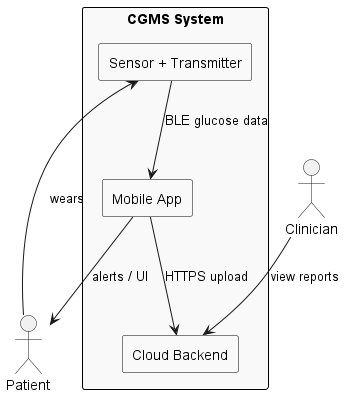

---

## 2. System Architecture (SysML)

### 2.1 Block Definition Diagram
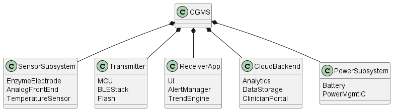

### 2.2 Internal Block Diagram
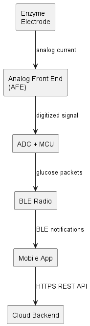

---

## 3. Interfaces

### 3.1 BLE GATT Interface
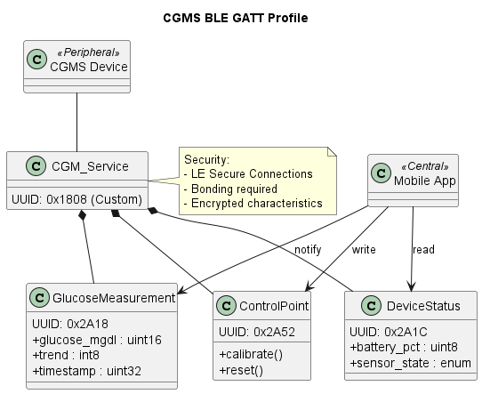

### 3.2 Cloud API Interface
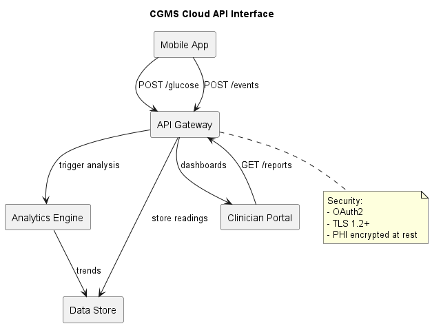

### 3.3 Sensor Interface
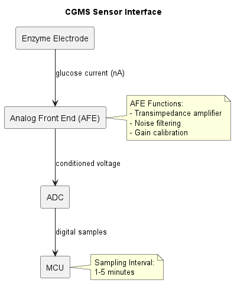

---

## 4. Software Design (UML)

### 4.1 Class Diagram
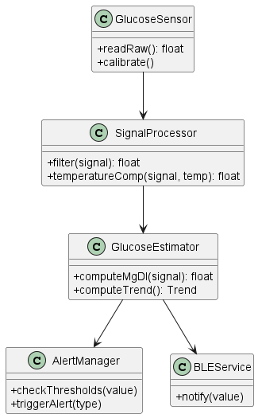

### 4.2 Sequence Diagram
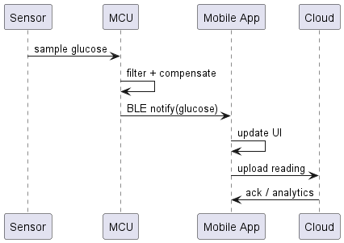

### 4.3 Sensor Lifecycle State Machine
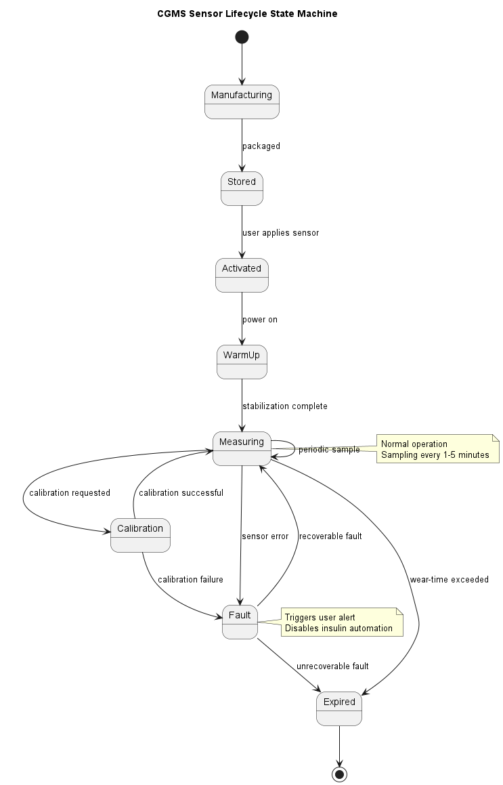

---

## 5. Safety & Risk Management

### 5.1 Safety-Critical Data Flow (IEC 62304)
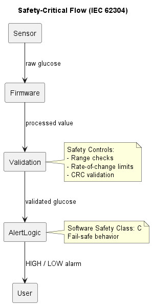

### 5.2 Fault Handling
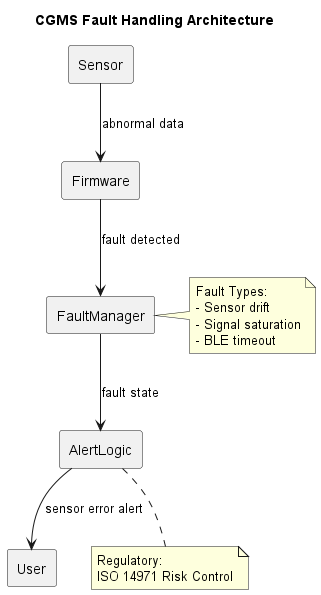

### 5.3 Alarm Path
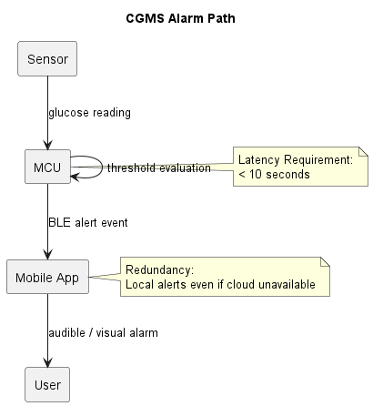

### 5.4 Fault Tree Analysis (ISO 14971)
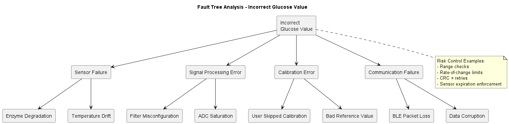
